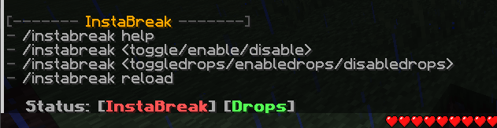
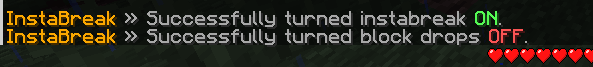

# InstaBreak
A Minecraft server (Spigot) plugin to instantly break blocks!

 

## Commands:
- `/instabreak [help]` - Shows the help message.
- `/instabreak <toggle/enable/disable>` - Toggle, enable, or disable instabreak.
- `/instabreak <toggledrops/enabledrops/disabledrops>` - Toggle, enable, or disable block drops.
- `/instabreak reload` - Reload InstaBreak's config.

 

## Permissions:
- `instabreak.use` - Permission to use /instabreak.
- `instabreak.reload` - Permission to reload InstaBreak's config.

 

## Screenshots:
**The help page:**

 

**Toggling instabreak and block drops:**

